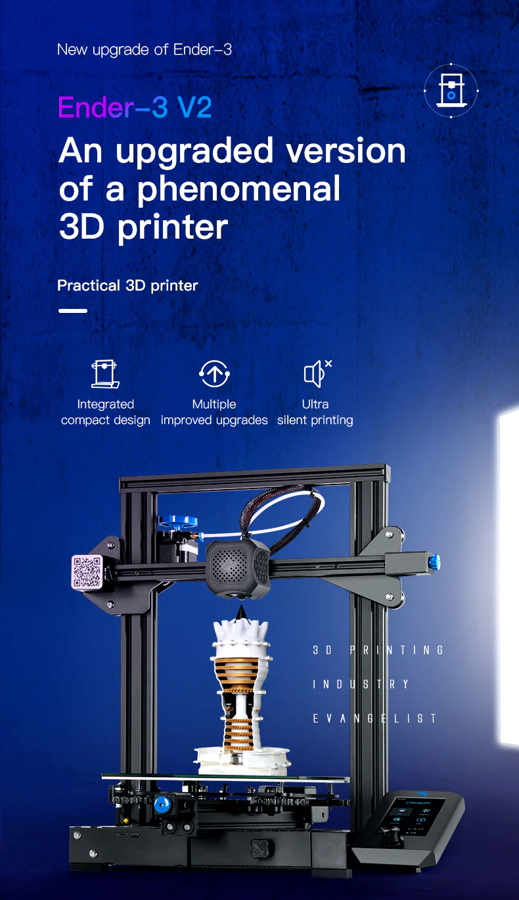
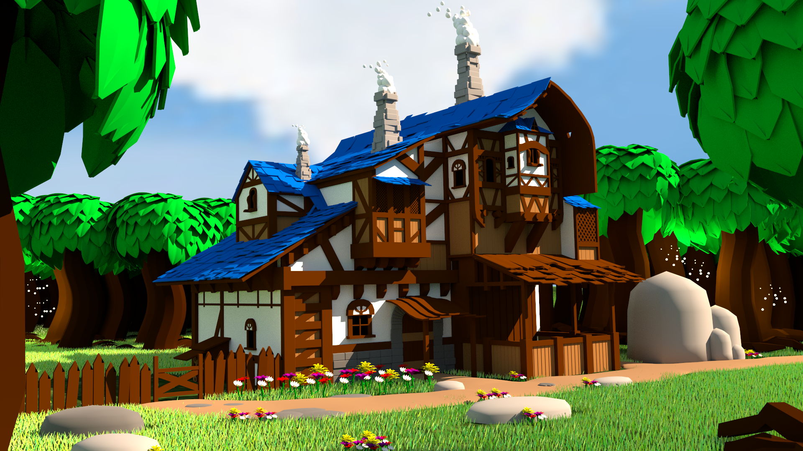
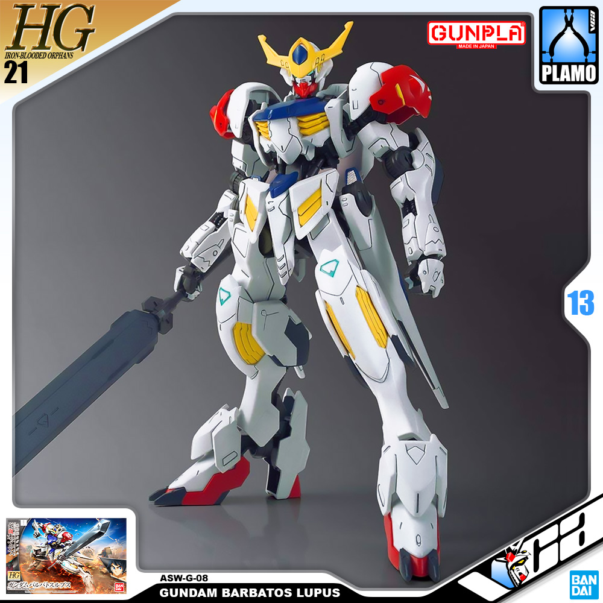
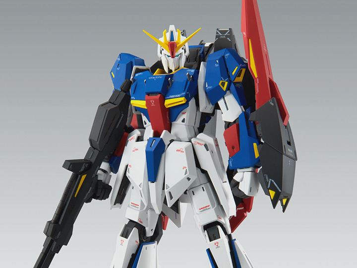

## **Hey ho!** 
Welcome to my About Me page,  
Let's start with my professional and educational achievements and then delve into what I like personally. Currently, I'm a programmer who graduated in Computer Science, I won this title in twenty twenty-two concurrently with my internship at the Apple Developer Academy, where I learned the basics of Swift and published five apps. My current Stack focuses on Swift, and I plan to keep it like that for now. My proudest professional project at the time of writing, 28-11-2023, is "SwiftDithering" an open-source library that brings selected dither patterns to Swift. You can read more about it in the Projects tab.

Okay, educational and professional taken out of the way, let's talk about myself.

 
### **Gaming**.  
I've been loving it since I can remember, and the sole reason I do this whole thing today is thanks to them.
 When I was a young child, I would think about how letters and numbers became the video games that I'd play every day or how a disc could be read, and this led me to keep an interest in tech for my whole life, starting with robotics, then later realizing I preferred programming for its versatility.
I didn't know if I  would like programming until I started university, and I loved it. Nowadays, the games I love the most are Soulslikes, Minecraft, and chill and laid-back.  

  
 
### **3D Printing**
During my time at the Academy, I decided to save for a 3D printer, which is the same one that I have until now, an Ender 3 v2, that was expensive (R$2500 ~= $500), but it's an okay machine that serves me well and differently from most hobbyist I see my printer as a tool, not a project. It enables me to make what I want in ways I couldn't.  

<blockquote class= "px-5 py-4 fs-6 text text-center orange-font-color fw-bolder" markdowm="1">
		

 "Empowers creativity through technology" - Maker's Muse 
</blockquote>  

With it, I've dabbled a bit in many other subjects, like painting, 3D CAD modeling, and others. It's pretty fun to create, modify, and assemble the objects. Like programming, there are many steps, including prototyping, which is one of the most important.

Talking about 3D modeling
I also like to do 3D models for fun, mostly scenery. Making characters, cars, or organic shapes is not my forte, but I want to make crab sonoshee from Redline someday to have it on my shelves.

 
### **Gunpla**
Who doesn't love giant robots who go pew-pew? I don't know since I love them, and I'm on a quest to watch every Gundam anime, currently halfway through Double Zeta.
I, unfortunately, have only one gunpla kit: Barbatos from Iron-Blooded Orphans, HG 1/144 Barbatos Lupus.

  

The kit itself has some fitting problems, but it looks really cool. My next One will probably be the MG Zeta if I can get a job before it's gone from the store.  

  
 
### **Anime**
I cited anime before, and, yes, I like to watch them, but I'm not too much of a season guy I tend to watch at max 4-to 5 shows per season, and most are older because my watchlist is pretty big, and I prefer to play or do my projects more than watch, that's one the reasons I like animes more, and despise series/movies, since the daily watch time is around 23 minutes way less than any other media, removing youtube from the equation.  

 
### **Programming**
Programming is also a hobby for me, like using other languages to do stuff that is unpractical just for fun, sometimes mods for games, other times a Windows app, whatever floats my boat!  

 

